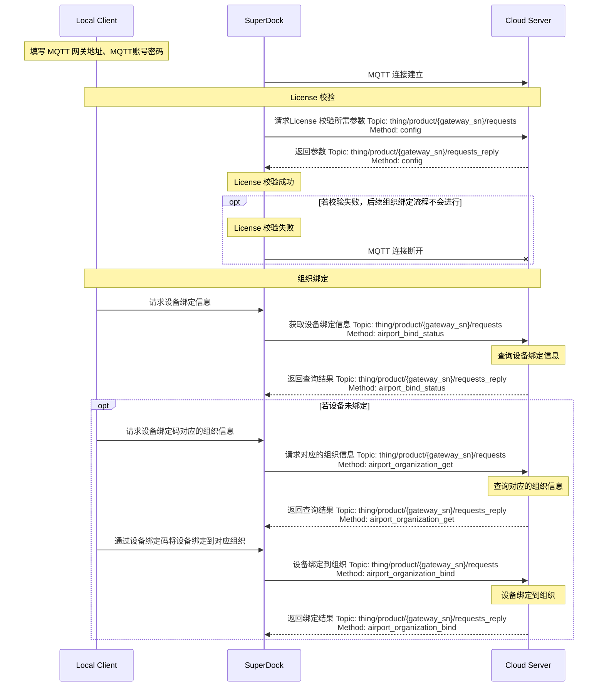

# 机场上云

## 概述

SuperDock机场上云使用SuperDock Local Client 程序进行上云，将机场和云服务通过MQTT进行连接。

## 交互时序

## 接口详细实现

*   [配置更新](/api-integration/api-reference/superdock-hangar/config)
    *   获取配置
*   [组织管理](/api-integration/api-reference/superdock-hangar/organization)
    *   获取设备绑定信息
    *   查询设备绑定对应的组织信息
        若设备绑定成功，机场与飞行器将被绑定到设备绑定码对应的组织。开发者可以自行设计如何通过在 Pilot 端填写的设备绑定码与组织 ID 以校验得到组织名称用于绑定。在我们提供的机场上云的 Demo 中，默认填写了设备绑定码，仅作为参考。
    *   使用设备绑定码绑定对应组织