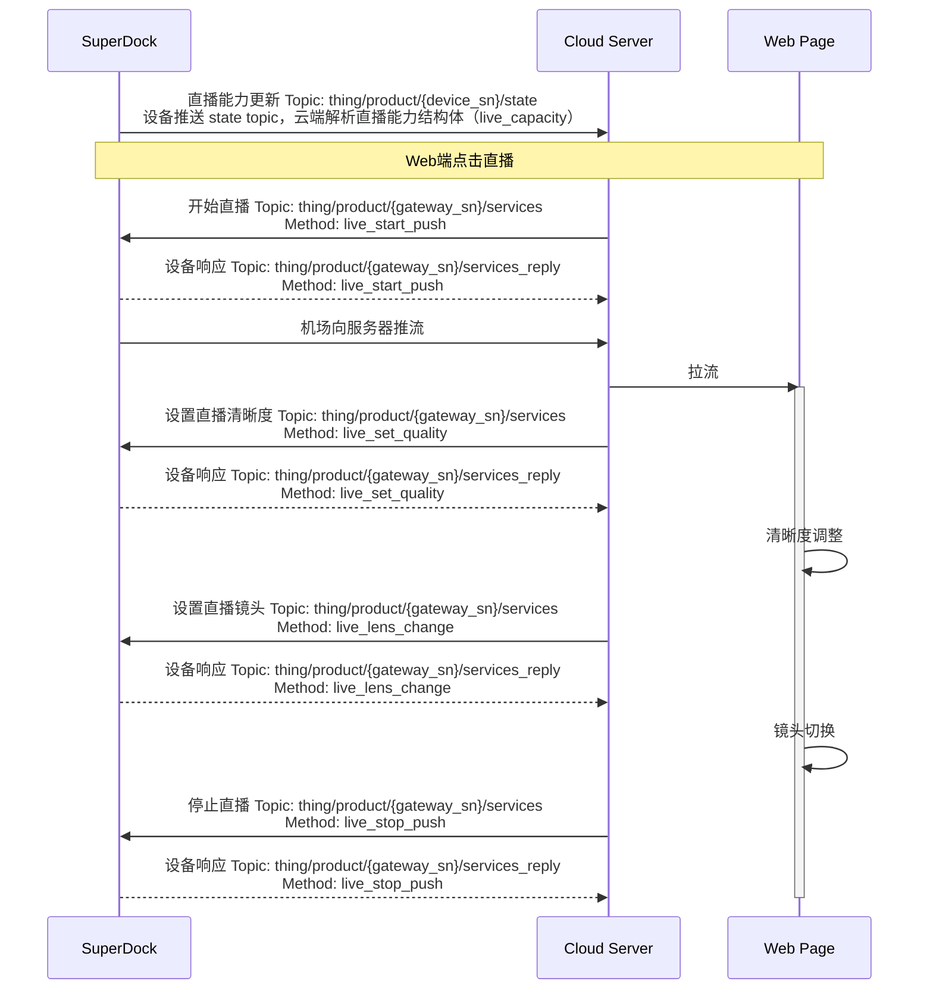

# 直播功能

## 功能概述

直播功能主要是把无人机相机负载和SuperDock机场的视频码流发给第三方云平台进行播放，用户可以方便的在远程web页面点击直播。直播功能支持直播的开始、停止、清晰度设置、镜头切换。

### 支持的直播类型

| 直播类型 | 描述 |
| :--- | :--- |
| RTMP | RTMP是 Real Time Messaging Protocol（实时消息传输[协议](https://baike.baidu.com/item/%E5%8D%8F%E8%AE%AE/13020269)）的首字母缩写。该协议基于 TCP，是一个协议族，包括 RTMP 基本协议及 RTMPT/RTMPS/RTMPE 等多种变种。RTMP 是一种设计用来进行实时数据通信的网络协议，主要用来在 Flash/AIR 平台和支持 RTMP 协议的流媒体/交互服务器之间进行音视频和数据通信。  |
| WebRTC/WHIP | WebRTC [（Web Real-Time Communication）](https://docs.dolby.io/streaming-apis/docs/webrtc-whip)是一种支持网页浏览器进行实时视频和音频流的通信技术，它提供接近实时的音视频流，确保用户体验的流畅性。该技术广泛应用于在线会议、在线教育、远程医疗等高实时通信的场景。 WHIP [（WebRTC-HTTP Ingestion Protocol）](https://millicast.medium.com/whip-the-magic-bullet-for-webrtc-media-ingest-57c2b98fb285)是一个基于 HTTP 的协议，旨在为 WebRTC 发布者和流媒体服务器之间提供一个标准化的信令协议，以便于将 WebRTC 流引入流媒体服务器。它允许基于 WebRTC 的内容输入到流媒体服务器或 CDN 中。 |

## 交互时序图

## 接口详细实现

[直播功能（MQTT）](/api-integration/api-reference/superdock-hangar/live)

*   **直播能力更新**  
    `live_capacity`（直播能力）字段是放在网关设备的物模型中的，同时只有当设备端有状态变化时推送。直播能力字段包含可用于直播的视频流总数、可同时进行直播的视频流总数、设备直播能力列表等信息。
*   **开始直播**  
    服务端下发`开始直播`指令，指令中指定使用的协议类型、直播质量等信息。直播视频流推流、拉流。
*   **停止直播**
*   **设置直播清晰度**  
    直播质量可设置，枚举值可在API章节查看。
*   **设置直播镜头**  
    直播功能可以在不影响直播进程的情况下，切换镜头。直播视频流的镜头类型枚举值，可在API章节自行查看。