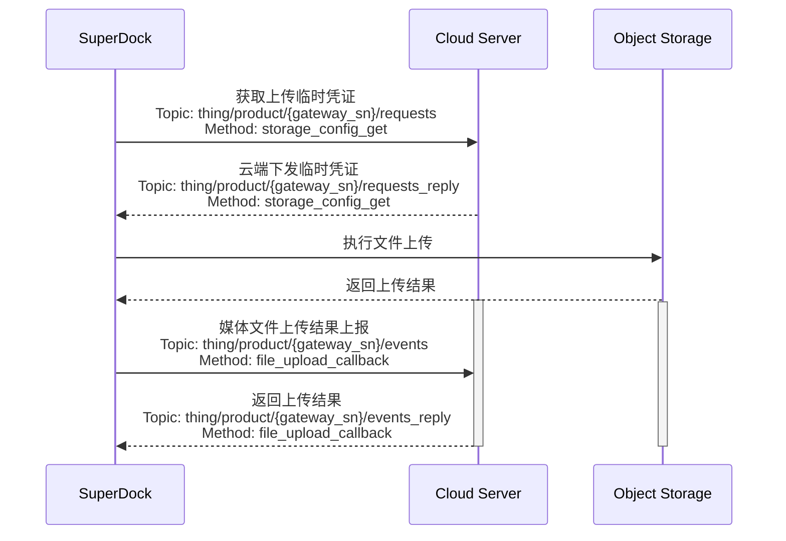

# 媒体管理

## 功能概述

媒体库功能集主要是SuperDock机场把飞行器上的媒体文件（图片/视频）下载到遥控器/机场本地存储，然后再通过网络上传到三方服务器的过程。媒体上传包含自动上传和手动上传功能，对于机场只有自动上传功能。

## 交互时序

## 接口详细实现

[媒体管理（MQTT）](/api-integration/api-reference/superdock-hangar/file)

*   **获取临时凭证**  
    每次媒体文件上传时，需要向服务端获取临时文件上传凭证，这样机场在上传时会带上该凭证给对象存储服务进行校验。
*   **媒体文件上传结果上报**  
    媒体文件传输结束后，机场会调用该接口向服务端告知对应的媒体文件上传结果。