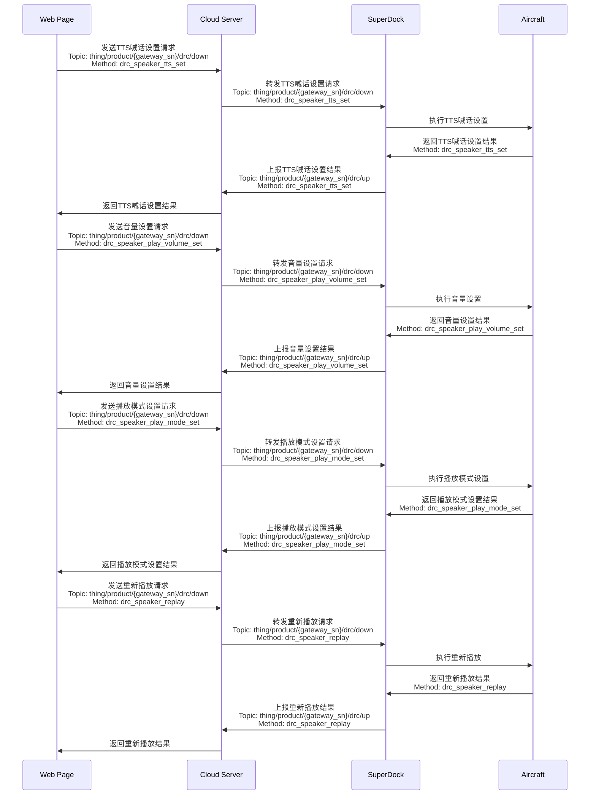
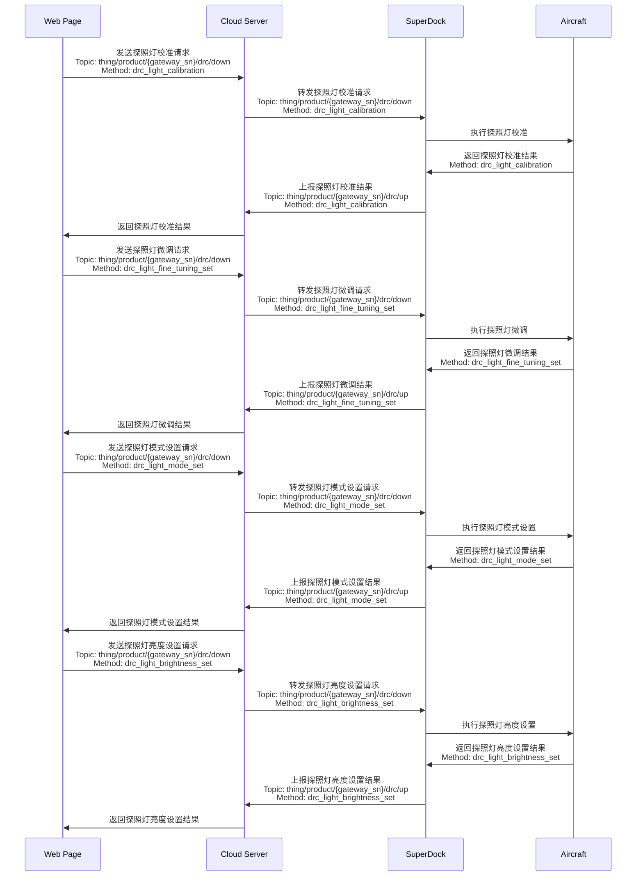

# 指令飞行/远程控制

## 功能概述

指令飞行功能的开放目的是解决无人机与机场在远程控制过程中，无法即时性操作的限制。在实际应用场景中，飞行器可以从空闲状态响应或暂停正在执行的航线任务。开发者通过手动方式继续控制设备或负载。通过指令飞行功能，开发者可以获得安全可靠的飞行器控制、高实时性的指令下发与直播画面传输、osd 信息上报以及对负载的控制能力。

指令飞行 API 可以划分为：飞行控制类（DRC）、负载控制类、flyto 指令与一键起飞指令。

*   **飞行控制类指令（DRC）**

    DRC（drone remote control）使用 MQTT 协议，并新增两个 Topic 表示上行与下行。[MQTT Topic 定义](/api-integration/api-reference/topic-definition)中对新增 drc Topic 结构体提供了介绍与示例。云端与设备成功建立 MQTT 连接以后，将分配一个 EMQX Broker 专门用于云端到设备端的 DRC 通信链路，使得传输与响应更快。DRC 指令需要提前开启指令飞行控制模式才能使用。DRC 指令一般不受飞行控制权的限制，但 `DRC-飞行控制 Method: drone_control`的使用必须有飞行控制权。

    

*   **负载控制类指令**：负载控制类指令都需要负载控制权。当前负载控制类指令控制相机与云台的动作，实现相机的拍照录像、相机变焦、云台重置等负载操作，从而获取目标的信息。支持的负载类型包括：AL1 探照灯，AS1 喊话器，MP130S喊话器，LP35负载等负载，其他负载可与商务联系进行适配 。相关的使用流程详见下方`喊话器控制`和`探照灯控制`章节。

*   **flyto 指令与一键起飞指令**：flyto 指令与一键起飞都用于让飞行器飞向目标点并悬停，区别在于前者用于飞行器在空中的场景，后者用于飞行器在机场内的场景。通过一键起飞指令飞到目标点后，飞行器后续可以继续执行 flyto 指令。当前仅支持单目标点。

### 模拟器调试

指令飞行新增支持模拟飞行。一旦使能模拟器，飞行器将正常执行飞行任务的准备工作，如机场开舱、启动等动作。飞行器将以模拟器字段中给定的经纬度作为起始点数据，执行航线任务，但飞行器不会实际起飞。飞行器执行任务期间的飞行器数据，将正常通过 osd 上报。

> **注意：** 模拟器执行飞行任务不会使能 RTK。经过模拟器调试后，若要继续开展室外航线任务，需要确保获取到稳定的 RTK 信号以正常执行飞行任务。

### 指令飞行 2.0

CloudAPI V1.7 迭代了指令飞行 2.0，提供更安全、更智能的飞行行为。

*   针对一键起飞协议（Method：takeoff_to_point），字段 “安全起飞高度 -- security_takeoff_height” 与字段 “指点飞行高度 -- commander_flight_height”，哪个字段中设定的高度数值更高，飞行器将爬升至该高度。
*   针对 flyto 协议（Method：fly_to_point），飞行器将爬升到设定的指点飞行高度，开发者可以通过对飞行器物模型中的可读可写字段 “指点飞行高度——commander_flight_height” 设置以调整指点飞行高度，该高度是全局生效的。

指令飞行 2.0可以兼容指令飞行 1.0。若使用指令飞行 2.0 配套固件，但发送了指令飞行 1.0 的协议内容：

*   针对一键起飞协议（Method：takeoff_to_point），字段 “指点飞行高度 -- commander_flight_height” 将被设置为 2 m。
*   针对 flyto 协议（Method：fly_to_point），飞行器将使用字段 “指点飞行高度 -- commander_flight_height” 的默认值最小值（2m）作为指点飞行高度。

#### 指令飞行交互时序图

> **注意：** 建议在下发指令飞行 API 前执行飞行控制权抢夺与负载控制权抢夺，以防多方同时对飞行器发送指令导致飞行器故障。

### 喊话器控制

AS1 喊话器控制功能允许无人机在执行任务时进行语音播报和喊话，适用于应急指挥、公共安全、活动宣传等场景。以下是喊话器的主要功能：

*   **TTS（文本转语音）播放**：
    *   **开始TTS播放**：通过指令 `drc_speaker_tts_play_start`，用户可以将文本内容转换为语音并通过喊话器播放。
    *   **停止TTS播放**：通过指令 `drc_speaker_play_stop`，用户可以停止当前的TTS播放。
*   **音量控制**：
    *   **设置音量**：通过指令 `drc_speaker_play_volume_set`，用户可以调整喊话器的音量大小。
*   **播放模式设置**：
    *   **设置播放模式**：通过指令 `drc_speaker_play_mode_set`，用户可以设置喊话器的播放模式，如单次播放、循环播放等。
*   **重新播放**：
    *   **重新播放**：通过指令 `drc_speaker_replay`，用户可以重新播放上一次的语音内容。

#### 喊话器控制交互时序图

### 探照灯控制

探照灯功能允许无人机在执行任务时进行照明，适用于夜间搜救、巡检、安防等场景。以下是探照灯的主要功能：

*   **校准**：
    *   **探照灯校准**：通过指令 `drc_light_calibration`，用户可以对探照灯进行校准，确保其照射方向的准确性。
*   **精细调节**：
    *   **探照灯精细调节**：通过指令 `drc_light_fine_tuning_set`，用户可以对探照灯的照射角度进行微调。
*   **模式设置**：
    *   **设置探照灯模式**：通过指令 `drc_light_mode_set`，用户可以设置探照灯的工作模式，如常亮模式、闪烁模式等。
*   **亮度控制**：
    *   **设置亮度**：通过指令 `drc_light_brightness_set`，用户可以调整探照灯的亮度。

#### 探照灯控制交互时序图

## 接口详细说明

> **说明：** 必须是飞行器在空中时，通过负载控制指令拍摄的媒体文件才会被媒体管理功能上传。

[指令飞行](/api-integration/api-reference/superdock-hangar/drc)

*   飞行控制类指令（DRC 指令）
*   负载控制类指令
*   flyto 指令
*   一键起飞指令

[远程控制](/api-integration/api-reference/superdock-hangar/remote-control)