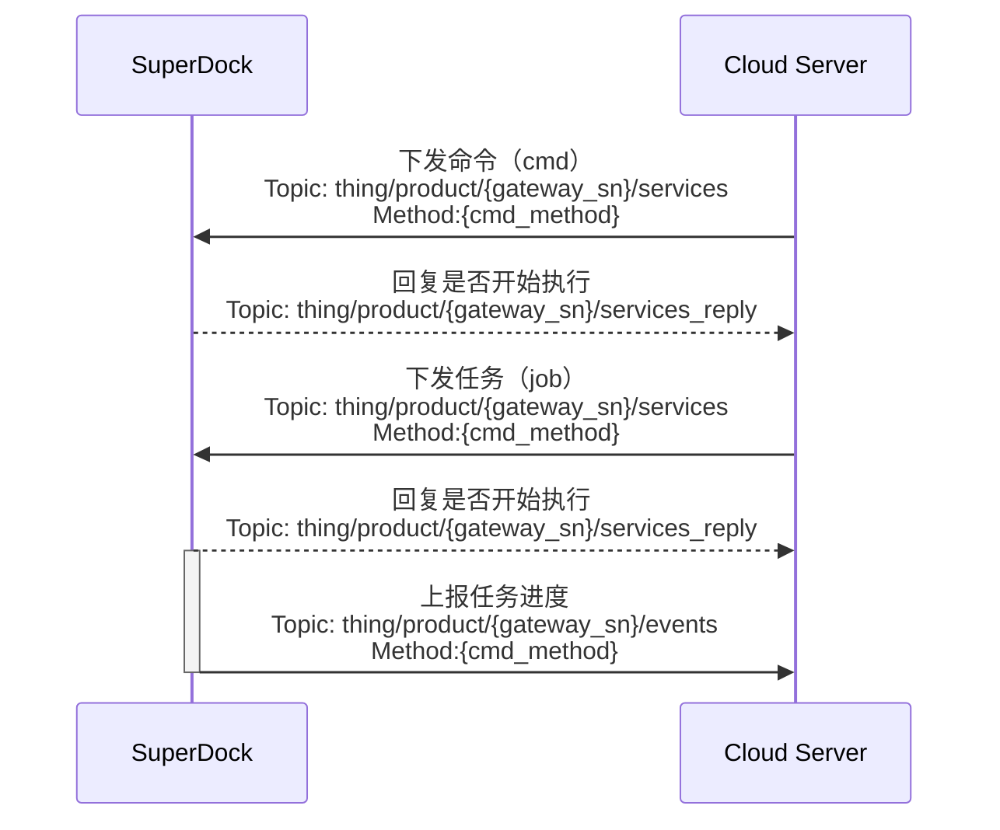

# 远程调试

## 功能概述

远程调试为在调试的作业流中实现无人值守，即让作业人员无需到现场，在云端就可以下发命令到设备端，进行设备的远程排障。远程调试命令可分为命令（cmd）和任务（job）。命令（cmd）一般指命令下发后，设备能即刻回复的行为，而任务（job）为任务下发后，设备需要持续动作的行为。

### 远程调试指令

下发的指令经由云端跟设备之间传输的`下发控制命令`协议中“method”字段指定，详细的协议内容请根据本节中的`接口详细实现`在`云端API章节`中查看。

### 任务（job）执行流程

任务（job）下发后，设备将会返回执行状态。该状态定义在传输协议的“status”字段中。 状态列举如下：

*   已下发
*   执行中
*   执行成功
*   暂停
*   拒绝
*   失败
*   取消或终止
*   超时

执行流程如下：

## 交互时序图

## 接口详细实现

[远程调试](/api-integration/api-reference/superdock-hangar/cmd)

*   命令进度
*   下发命令
*   下发任务
*   ......