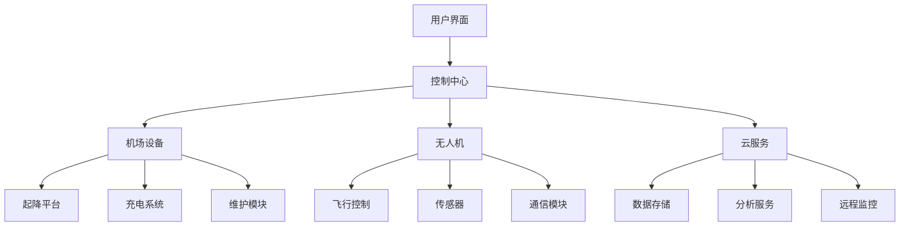
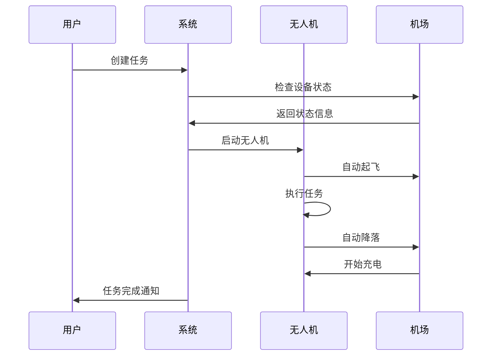

# 系统概览

SBIM 无人机自动机场系统是一个完整的自动化解决方案，集成了硬件设备、软件平台和云服务，为用户提供全自动的无人机作业体验。

## 系统架构

## 核心组件

### 1. 自动机场设备

**起降平台**
- 精确定位系统
- 自动导引装置
- 环境监测传感器

**充电系统**
- 无线充电技术
- 智能电池管理
- 快速充电支持

**维护模块**
- 自动清洁系统
- 设备状态检测
- 预防性维护提醒

### 2. 无人机系统

**飞行平台**
- 多旋翼/固定翼支持
- 模块化载荷设计
- 冗余安全系统

**传感器套件**
- 高分辨率相机
- 多光谱传感器
- 激光雷达（可选）

**通信系统**
- 4G/5G 数据传输
- 实时视频流
- 遥测数据上传

### 3. 软件平台

**任务规划**
- 可视化路径设计
- 智能航线优化
- 多机协同作业

**实时监控**
- 飞行状态显示
- 设备健康监测
- 异常情况告警

**数据管理**
- 自动数据采集
- 云端存储同步
- 智能分析处理

## 核心功能

### 全自动作业流程

1. **任务接收** - 系统接收作业指令
2. **设备检查** - 自动检测设备状态
3. **起飞准备** - 无人机自动就位
4. **执行任务** - 按预定路线执行作业
5. **自动返航** - 任务完成后自动返回
6. **数据处理** - 自动上传和处理数据

### 智能调度系统

- **优先级管理**：根据任务重要性智能排序
- **资源优化**：合理分配设备和时间资源
- **天气适应**：根据天气条件调整作业计划
- **故障处理**：自动检测并处理设备故障

### 安全保障机制

- **多重冗余**：关键系统采用冗余设计
- **实时监控**：24/7 系统状态监控
- **紧急处理**：自动故障检测和应急响应
- **合规保证**：符合航空管理法规要求

## 应用场景

### 农业应用
- 作物生长监测
- 病虫害识别
- 精准施药作业
- 产量评估

### 基础设施巡检
- 电力线路检查
- 管道泄漏检测
- 桥梁结构监测
- 道路状况评估

### 环境监测
- 空气质量检测
- 水质监测
- 森林火灾预警
- 生态环境评估

### 安防监控
- 边界巡逻
- 人群监控
- 事件响应
- 证据收集

## 工作流程

### 日常作业流程

### 数据处理流程

1. **数据采集** - 传感器实时采集数据
2. **本地预处理** - 机载计算机初步处理
3. **数据传输** - 通过网络上传到云端
4. **云端分析** - AI 算法深度分析
5. **结果生成** - 自动生成分析报告
6. **用户通知** - 推送结果给用户

## 技术优势

### 高度自动化
- 无需人工干预的全自动作业
- 智能故障检测和自我修复
- 自适应环境变化

### 精确可靠
- 厘米级定位精度
- 99.9% 系统可用性
- 多重安全保障

### 易于扩展
- 模块化系统设计
- 支持多种载荷类型
- 灵活的部署方案

### 成本效益
- 降低人工成本
- 提高作业效率
- 减少设备损耗

---

通过这个系统概览，您应该对 SBIM 无人机自动机场系统有了基本的了解。接下来，您可以查看 [云端 API 文档](../cloud-api/index.md) 了解如何集成系统。
