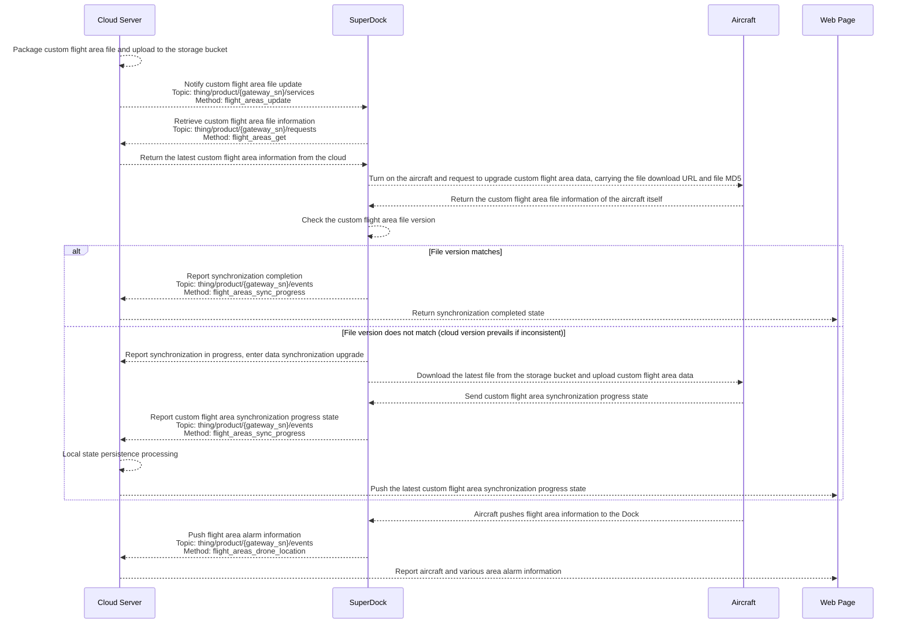

# Custom Flight Area [In Adaptation]

## Function Overview

The Cloud API adds custom flight area functionality. Users can designate sensitive locations as restricted zones and synchronize this information with the Docks within the project. When the drone performs a task, it automatically bypasses the restricted zones, ensuring the safety and compliance of operations. This function defines the aircraft's flight area via the custom flight area file. **Click to download the [Custom Flight Area File Template](/files/api-reference/custom-flight-area-template.json)**.

This function allows users to plan custom flight areas on the map. There are two types of custom flight areas:

1.  Custom Operation Area: Within the custom operation area, the aircraft can take off and perform tasks but cannot fly out of the area.
2.  Custom Restricted-Flight Area: Outside the custom restricted-flight area, the aircraft can operate but cannot fly into the area.

## Interaction Sequence Diagram

## Detailed API Implementation

[Custom Flight Area](/en/api-integration/api-reference/superdock-hangar/custom-flight-area)
