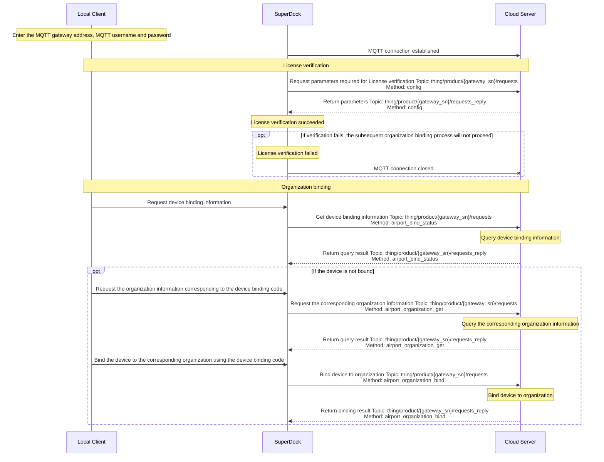

# Dock Cloud Access

## Overview

SuperDock Dock cloud access uses the SuperDock Local Client program to access the cloud, connecting the Dock and the cloud service over MQTT.

## Interaction Sequence

## Interface Implementation Details

*   [Configuration Update](/en/api-integration/api-reference/superdock-hangar/config)
    *   Get configuration
*   [Organization Management](/en/api-integration/api-reference/superdock-hangar/organization)
    *   Get device binding information
    *   Query the organization information to which the device is bound
        If the device is bound successfully, the Dock and aircraft will be bound to the organization corresponding to the device binding code. Developers can design how to verify and obtain the organization name for binding using the device binding code and organization ID entered on the Pilot side. In the Dock cloud access Demo we provide, the device binding code is filled in by default, for reference only.
    *   Bind the corresponding organization using the device binding code
