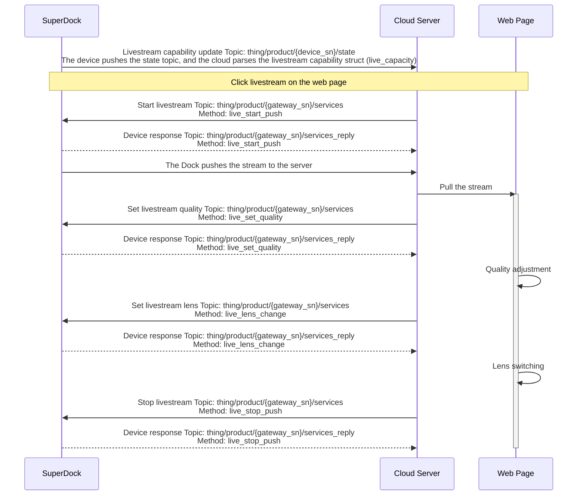

# Livestream Feature

## Feature Overview

The livestream feature mainly sends the video streams from the drone camera payload and the SuperDock Dock to a third-party cloud platform for playback, allowing users to conveniently start a livestream by clicking on a remote web page. The livestream feature supports starting and stopping the livestream, setting the quality, and switching the lens.

### Supported Livestream Types

| Livestream Type | Description |
| :--- | :--- |
| RTMP | RTMP is the acronym for Real Time Messaging Protocol. The protocol is based on TCP and is a protocol family, including the basic RTMP protocol and variants such as RTMPT/RTMPS/RTMPE. RTMP is a network [protocol](https://baike.baidu.com/item/%E5%8D%8F%E8%AE%AE/13020269) designed for real-time data communication, mainly used for audio, video, and data communication between the Flash/AIR platform and streaming/interactive servers that support the RTMP protocol.  |
| WebRTC/WHIP | WebRTC [(Web Real-Time Communication)](https://docs.dolby.io/streaming-apis/docs/webrtc-whip) is a communication technology that enables web browsers to carry out real-time video and audio streaming. It provides near-real-time audio and video streams to ensure a smooth user experience. This technology is widely used in scenarios with high real-time communication requirements, such as online conferencing, online education, and telemedicine. WHIP [(WebRTC-HTTP Ingestion Protocol)](https://millicast.medium.com/whip-the-magic-bullet-for-webrtc-media-ingest-57c2b98fb285) is an HTTP-based protocol that aims to provide a standardized signaling protocol between WebRTC publishers and streaming media servers, making it easier to ingest WebRTC streams into streaming media servers. It allows WebRTC-based content to be ingested into streaming media servers or CDNs. |

## Interaction Sequence Diagram

## Detailed API Implementation

[Livestream Feature (MQTT)](/en/api-integration/api-reference/superdock-hangar/live)

*   **Livestream capability update**  
    The `live_capacity` (livestream capability) field is placed in the Thing Model of the gateway device and is pushed only when there is a state change on the device side. The livestream capability field contains information such as the total number of video streams available for livestreaming, the total number of video streams that can be livestreamed simultaneously, and the list of device livestream capabilities.
*   **Start livestream**  
    The server issues the `Start livestream` command, which specifies information such as the protocol type and livestream quality to be used. The livestream video stream is pushed and pulled.
*   **Stop livestream**
*   **Set livestream quality**  
    The livestream quality can be set. The enum values can be found in the API section.
*   **Set livestream lens**  
    The livestream feature can switch the lens without affecting the livestream process. The enum values for the lens type of the livestream video stream can be found in the API section.
