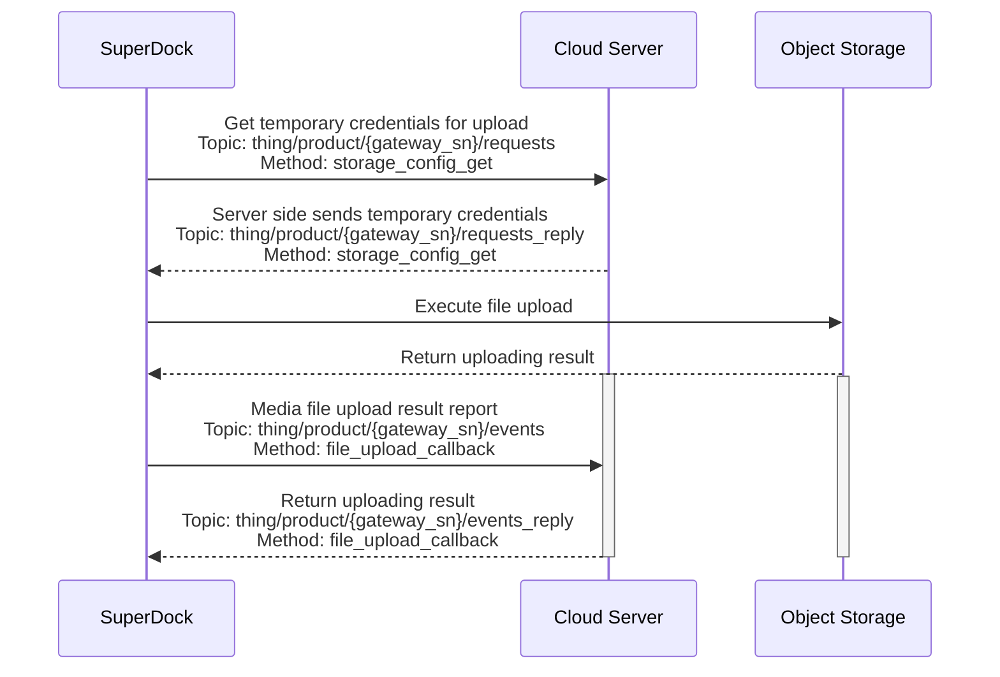

# Media Management

## Function Overview

The media library feature set is mainly the process in which the SuperDock Dock downloads the media files (photos/videos) from the aircraft to the local storage of the remote controller/Dock, and then uploads them to a third-party server over the network. Media upload includes both auto upload and manual upload; for the Dock, only auto upload is available.

## Interaction Sequence Diagram

## Detailed API Implementation

[Media Management (MQTT)](/en/api-integration/api-reference/superdock-hangar/file)

*   **Obtain Temporary Credential**  
    For each media file upload, you need to obtain a temporary file upload credential from the server, so that the Dock will bring this credential to the object storage service for verification when uploading.
*   **Report Media File Upload Result**  
    After the media file transfer is finished, the Dock will call this interface to inform the server of the corresponding media file upload result.
