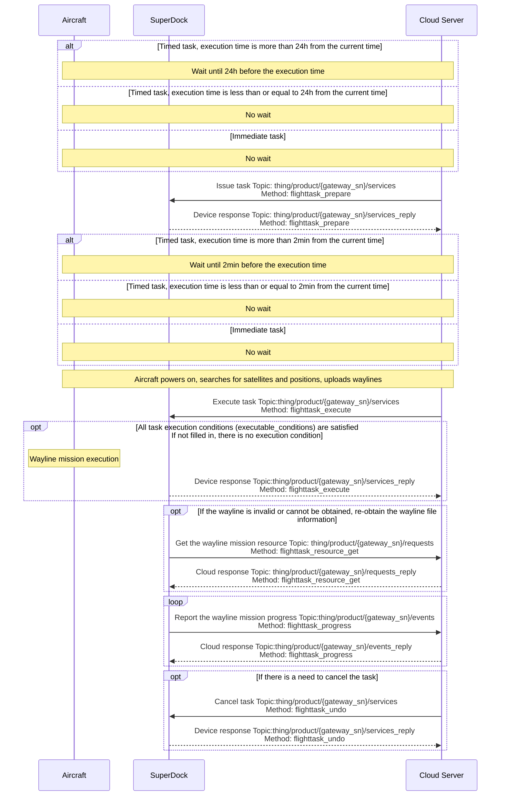
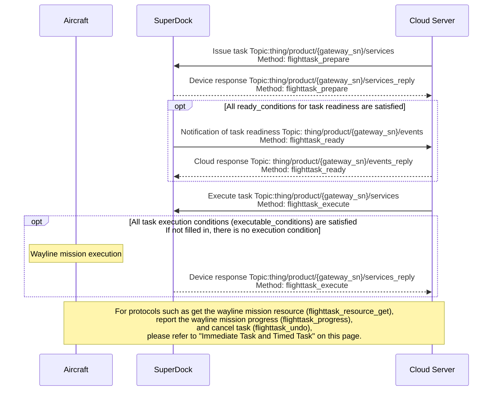

# Wayline Management

## Function Overview

Wayline management is an important function of drone autonomous operation, enabling batch and intelligent operation across industry domains. The Cloud API provides relevant interfaces that implement functions such as cloud-side shared viewing, issuing for execution, cancellation, and progress reporting of wayline missions. Users need to follow the [Wayline File Format Specification (WPML)](https://developer.dji.com/doc/cloud-api-tutorial/cn/api-reference/dji-wpml/overview.html) to write wayline files and define wayline missions. Multiple waylines can be defined in one wayline mission.

For the wayline mission interfaces, the fields in the interfaces, and the explanation of the fields, please refer to the guide of "Detailed API Realization" on this page. If an error occurs while using the wayline management function, please look up the corresponding error description in the [Task Error Code List](/en/api-integration/cloud-api/error-codes) section according to the returned error code.

### Simulated Debugging

Wayline management newly supports simulated wayline flights. Once the simulator is enabled, the aircraft will go through the preparatory steps of the wayline mission as usual, such as opening the dock cover and starting up. The aircraft will use the longitude and latitude given in the simulator fields as the starting point data to execute the wayline mission, but the aircraft will not actually take off. The aircraft's data during mission execution will be reported as usual via the `osd`.

> **Note:** A simulated wayline mission does not enable RTK. After simulated debugging, if you want to continue with outdoor wayline missions, you must ensure that a stable RTK signal is obtained so that the wayline mission can be executed normally.

### Resume from Breakpoint

When a wayline mission cannot be completed in a single flight for some reason (for example, the wayline is too long, bad weather, or a manual interruption), resume from breakpoint allows the wayline mission to continue from the recorded breakpoint, without having to fly again from the start.

*   **Return from the breakpoint:**  
    As long as the wayline mission is not finished, the breakpoint information will be recorded. During wayline execution, the wayline mission execution progress (Method: flighttask_progress) will be reported continuously, and the breakpoint information will be reported through this API. After the aircraft returns to the dock, the breakpoint information is uploaded by the dock to the cloud for storage. For detailed breakpoint information, see the [related breakpoint fields](/en/api-integration/api-reference/superdock-hangar/wayline#report-wayline-mission-progress) in the `Report the wayline mission progress API`.

*   **Resume from the breakpoint:**  
    The cloud issues a resume-from-breakpoint mission, and the `Issue task API` will contain related breakpoint fields. The dock provides the breakpoint information to the aircraft, and the aircraft flies to the breakpoint and continues the wayline mission. **When resuming from the breakpoint, the `Safe takeoff altitude field (wpml:takeOffSecurityHeight)` in the KMZ file of the wayline mission will be replaced by the `RTH altitude field (rth_altitude)` of the "MQTT Issue Task API (Method: flighttask_prepare)`, to avoid the possibility of colliding with obstacles between the takeoff point and the breakpoint.**

## Interaction Sequence Diagram

Wayline missions are divided into immediate tasks, timed tasks, and conditional tasks. The interaction of conditional tasks differs from that of other tasks, so we introduce them separately.

### Immediate Task and Timed Task

### Conditional Task

## Detailed API Realization

> **Notes:**
>
> *   We have deprecated the `Create wayline task` interface, please use the `Issue task` and `Execute task` interfaces.
> *   If the `task_type` is specified as "execute immediately", the device side limits the time error to 30s. If the difference between the time when the device receives the command and the `execute_time` exceeds 30s, an error will be reported and the task cannot be executed normally.
> *   If the device receives a wayline mission execution command again while it is in the process of executing a wayline mission, the newly received wayline mission will not be executed and the device will report an error.
> *   If the user's cloud service cannot access the external network, the Configuration Update function must be implemented to issue the URL of an NTP service accessible to the cloud service, so as to achieve clock synchronization; otherwise, the wayline mission cannot be executed normally.

[Wayline Management (MQTT)](/en/api-integration/api-reference/superdock-hangar/wayline)

*   **Notification of device exiting the RTH state**
    *   Entering the "RTH exiting state" means that, while the aircraft is in RTH mode, it exits the RTH process due to one of the reasons shown in the `reason` field of this API. Similarly, exiting the "RTH exiting state" means that the aircraft has stopped this process of exiting RTH.
    *   It is used to notify the device's RTH exiting state. If obstacle avoidance is unexpectedly triggered when the device returns after completing a task, the device will enter the "RTH exiting state". To prevent device damage due to causes such as battery depletion, the user needs to be notified of this state and issue an RTH command to bring the device out of the "RTH exiting state".
*   **Report the flight task progress**  
    The wayline mission execution progress can be reported. The reported information includes progress information and extension information.
*   **Notification of task readiness**  
    After a conditional task is issued, the device checks at a fixed frequency whether all the `ready_conditions` in the `Issue task` API are satisfied. If all are satisfied, a task readiness notification (flighttask_ready) event will be sent.
*   **Create wayline mission (Deprecated)**
*   **Issue task**  
    Wayline management currently adds the concept of "pre-release". Issuing the flight task to the dock and aircraft in advance reserves some preparation time. After the `Issue task` interface is called, the `Execute task` interface still needs to be called to execute. `task_type` specifies the task type. `execute_time` is required for timed tasks and immediate tasks, and does not need to be considered for conditional tasks. `ready_conditions` is required for conditional tasks; if all are satisfied, a `flighttask_ready` event notification will be sent. `executable_conditions` has no restriction on task type—execution of all task types can have execution condition restrictions; if not filled in, it means there is no execution condition.
*   **Execute task**
*   **Cancel task**  
    Batch task cancellation is supported. Only the issuing of a task can be canceled; a task that is currently executing cannot be canceled.
*   **Get the wayline mission resource**  
    Get the wayline mission resource will return the wayline file information of the wayline mission corresponding to `flight_id`.
