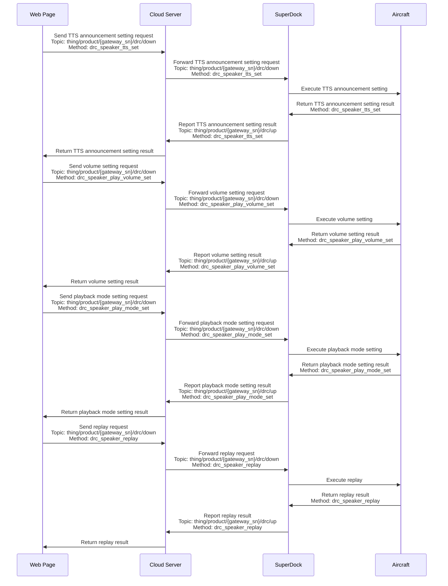
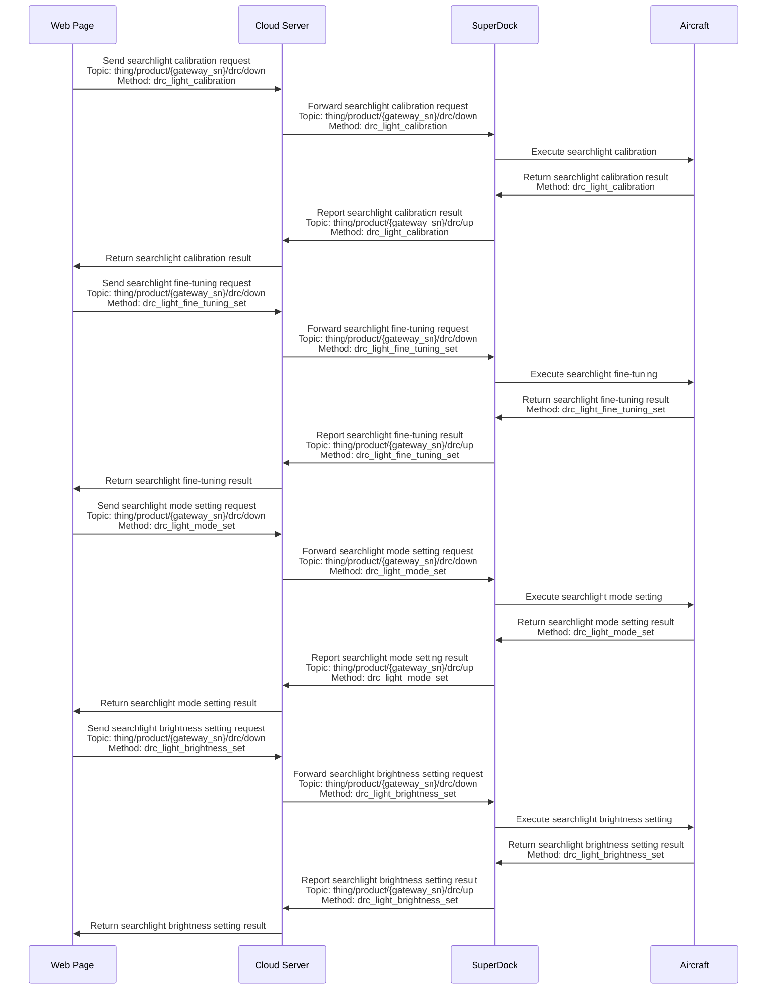

# Live Flight Controls / Remote Control

## Function Overview

The Live Flight Controls function is provided to solve the restriction that the drone and Dock cannot be operated in real time during remote control. In real-world scenarios, the aircraft can respond from an idle state or pause an executing wayline mission. Developers can continue to control the device or payload manually. Through the Live Flight Controls function, developers gain safe and reliable aircraft control, highly real-time command issuing and live streaming transmission, osd information reporting, and payload control capabilities.

The Live Flight Controls API can be divided into: flight control commands (DRC), payload control commands, flyto commands, and one-key takeoff commands.

*   **Flight control commands (DRC)**

    DRC (drone remote control) uses the MQTT protocol and adds two new Topics to represent uplink and downlink. [MQTT Topic Definition](/en/api-integration/api-reference/topic-definition) provides an introduction and examples of the new drc Topic structure. After the cloud and the device successfully establish an MQTT connection, a dedicated EMQX Broker is allocated for the DRC communication link from the cloud to the device side, making transmission and response faster. DRC commands require the Live Flight Controls mode to be enabled in advance. DRC commands are generally not restricted by flight control authority, but the use of `DRC-flight control Method: drone_control` requires flight control authority.

    

*   **Payload control commands**: All payload control commands require payload control authority. Current payload control commands control the actions of the camera and gimbal, realizing payload operations such as camera photo taking and video recording, camera zooming, and gimbal reset, so as to obtain target information. Supported payload types include: AL1 Searchlight, AS1 Speaker, MP130S Speaker, LP35 payload, and other payloads. For other payloads, contact business support for adaptation. For the relevant usage procedures, see the `Speaker Control` and `Searchlight Control` sections below.

*   **flyto commands and one-key takeoff commands**: Both flyto commands and one-key takeoff are used to make the aircraft fly to a target point and hover. The difference is that the former is used when the aircraft is in the air, while the latter is used when the aircraft is inside the Dock. After flying to the target point via a one-key takeoff command, the aircraft can subsequently continue to execute flyto commands. Currently only a single target point is supported.

### Simulator Debugging

Live Flight Controls newly supports simulated flights. Once the simulator is enabled, the aircraft will normally perform the preparatory work for the flight mission, such as opening the dock cover and starting up. The aircraft will use the longitude and latitude given in the simulator fields as the starting point data to execute the wayline mission, but the aircraft will not actually take off. The aircraft data during mission execution will be reported normally via osd.

> **Note:** A simulated flight mission will not enable RTK. After simulator debugging, if you want to continue carrying out outdoor wayline missions, you must ensure that a stable RTK signal is obtained in order to execute the flight mission normally.

### Live Flight Controls 2.0

CloudAPI V1.7 iterated Live Flight Controls 2.0, providing safer and more intelligent flight behaviors.

*   For the one-key takeoff protocol (Method: takeoff_to_point), whichever of the field "safe takeoff altitude -- security_takeoff_height" and the field "commander flight altitude -- commander_flight_height" has the higher altitude value, the aircraft will climb to that altitude.
*   For the flyto protocol (Method: fly_to_point), the aircraft will climb to the set commander flight altitude. Developers can adjust the commander flight altitude by setting the readable and writable field "commander flight altitude -- commander_flight_height" in the aircraft thing model. This altitude takes effect globally.

Live Flight Controls 2.0 is backward compatible with Live Flight Controls 1.0. If you use the firmware that supports Live Flight Controls 2.0 but send protocol content for Live Flight Controls 1.0:

*   For the one-key takeoff protocol (Method: takeoff_to_point), the field "commander flight altitude -- commander_flight_height" will be set to 2 m.
*   For the flyto protocol (Method: fly_to_point), the aircraft will use the default minimum value (2 m) of the field "commander flight altitude -- commander_flight_height" as the commander flight altitude.

#### Live Flight Controls Interaction Sequence Diagram

> **Note:** It is recommended to seize flight control authority and payload control authority before issuing the Live Flight Controls API, to prevent multiple parties from sending commands to the aircraft at the same time, which could cause an aircraft fault.

### Speaker Control

The AS1 Speaker control function allows the drone to make voice broadcasts and announcements while performing tasks, and is suitable for scenarios such as emergency command, public safety, and event promotion. The following are the main functions of the Speaker:

*   **TTS (text-to-speech) playback**:
    *   **Start TTS playback**: Through the command `drc_speaker_tts_play_start`, users can convert text content into speech and play it through the Speaker.
    *   **Stop TTS playback**: Through the command `drc_speaker_play_stop`, users can stop the current TTS playback.
*   **Volume control**:
    *   **Set volume**: Through the command `drc_speaker_play_volume_set`, users can adjust the volume of the Speaker.
*   **Playback mode setting**:
    *   **Set playback mode**: Through the command `drc_speaker_play_mode_set`, users can set the playback mode of the Speaker, such as single playback, loop playback, etc.
*   **Replay**:
    *   **Replay**: Through the command `drc_speaker_replay`, users can replay the last voice content.

#### Speaker Control Interaction Sequence Diagram

### Searchlight Control

The Searchlight function allows the drone to illuminate when performing tasks, and is suitable for scenarios such as night search and rescue, inspection, and security. The following are the main functions of the Searchlight:

*   **Calibration**:
    *   **Searchlight calibration**: Through the command `drc_light_calibration`, users can calibrate the Searchlight to ensure the accuracy of its illumination direction.
*   **Fine adjustment**:
    *   **Searchlight fine adjustment**: Through the command `drc_light_fine_tuning_set`, users can fine-tune the illumination angle of the Searchlight.
*   **Mode setting**:
    *   **Set searchlight mode**: Through the command `drc_light_mode_set`, users can set the working mode of the Searchlight, such as constant mode, flashing mode, etc.
*   **Brightness control**:
    *   **Set brightness**: Through the command `drc_light_brightness_set`, users can adjust the brightness of the Searchlight.

#### Searchlight Control Interaction Sequence Diagram

## API Detailed Description

> **Note:** Only media files captured via payload control commands while the aircraft is in the air will be uploaded by the media management function.

[Live Flight Controls](/en/api-integration/api-reference/superdock-hangar/drc)

*   Flight control commands (DRC commands)
*   Payload control commands
*   flyto commands
*   One-key takeoff commands

[Remote Control](/en/api-integration/api-reference/superdock-hangar/remote-control)
