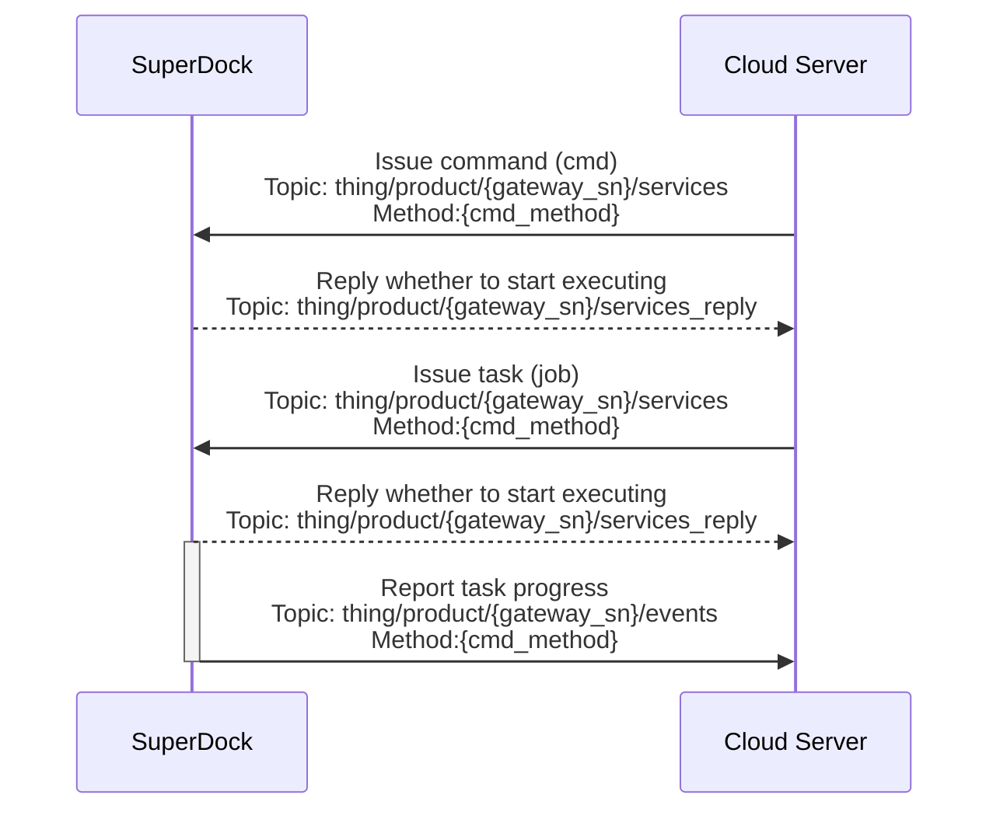

# Remote Debugging

## Functional Overview

Remote debugging enables unattended operation in the debugging workflow, allowing operators to issue commands to the device from the cloud without going on site to perform remote troubleshooting of the device. Remote debugging commands can be divided into commands (cmd) and tasks (job). A command (cmd) generally refers to a behavior to which the device can reply immediately after the command is issued, while a task (job) refers to a behavior that requires the device to keep acting after the task is issued.

### Remote Debug Instructions

The instruction to be issued is specified by the "method" field in the `Send Control Command` protocol transmitted between the cloud and the device. For the detailed protocol content, refer to the `Detailed API Implementation` in this section and view it in the `Cloud API chapter`.

### Task (job) Execution Process

After a task (job) is issued, the device returns the execution status. This status is defined in the "status" field of the transport protocol. The statuses are listed as follows:

*   Issued
*   In progress
*   Executed successfully
*   Paused
*   Rejected
*   Failed
*   Canceled or terminated
*   Timeout

The execution flow is as follows:

## Interaction Sequence Diagram

## Detailed API Implementation

[Remote Debugging](/en/api-integration/api-reference/superdock-hangar/cmd)

*   Command progress
*   Issue command
*   Issue task
*   ......
